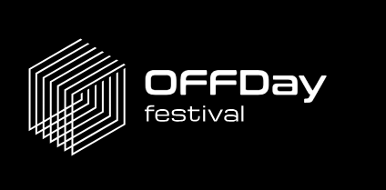

<h1>OFFDay Festival website project</h1>
<h2>Esta web ha sido creada como proyecto final para el módulo Diseño web con HTML, CSS y JavaScript en la escuela CEI.</h2>

<h3>Tecnologías utilizadas</h3>
     
     
    

